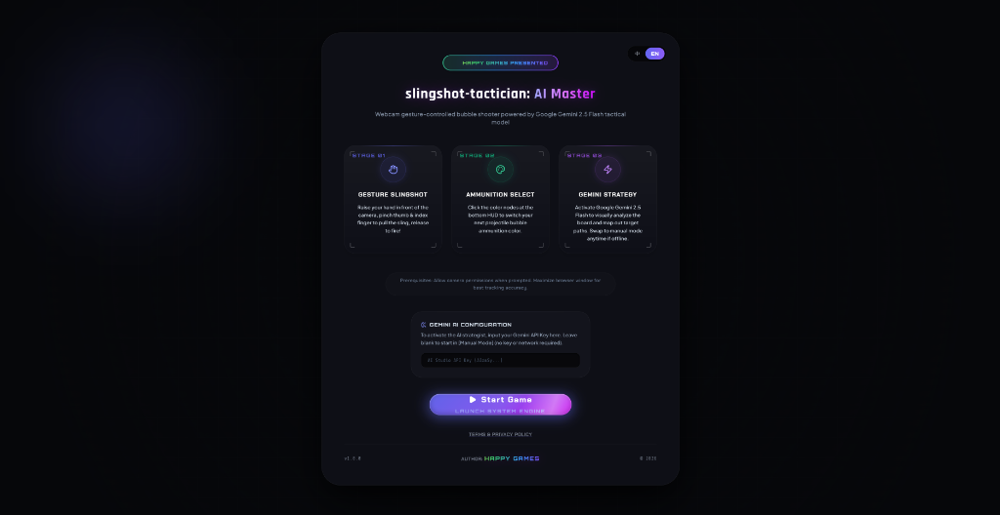

# slingshot-tactician (Slingshot Tactician: AI Master)

[](README_zh.md)
[](https://opensource.org/licenses/Apache-2.0)
[](https://react.dev/)
[](https://vite.dev/)
[](https://ai.google.dev/)



slingshot-tactician is a futuristic cyber-style bubble shooter game controlled via webcam hand gestures (powered by MediaPipe) and strategically guided in real time by the Google Gemini 2.5 Flash multimodal model.

Presented by HAPPY Games (happy_games@vip.qq.com), this experience is designed for players seeking visual excellence and advanced human-computer interaction.

---

## [Key Features]

* **Real-Time Bilingual Engine (CN/EN)**: Seamlessly toggle between English and Chinese for the game HUD and the AI tactical debugging dashboard. The AI model adapts its responses (directives and rationales) dynamically.
* **60 FPS Physics & Render Decoupling**: MediaPipe tracking runs asynchronously from the primary physics loop, particle engines, and canvas rendering pipelines to ensure butter-smooth frame rates.
* **Dual Control Mode (AI vs. Manual)**:
  * **AI Strategy Mode**: Gemini 2.5 Flash analyzes real-time screenshots of the board to recommend the optimal ammunition color and highlight the exact aiming trajectory and rebound points.
  * **Manual Selection Mode**: Bypasses all API network calls (zero token cost) to allow local, offline play where you manually choose colors and aim angles.
* **Bouncing Trajectory Predictor**: Visualizes real-time bouncing trajectory guidelines reflecting boundaries and bubble collisions, complete with aiming rings.
* **Exponential Moving Average Filter (EMA)**: Applies a low-pass filter to指尖 coordinates at 60 FPS to smooth camera signal noise and provide stable, precise slingshot drawing controls.
* **Multi-Layered Security & Gatekeeper**:
  * Blocks page loading with a secure entry gateway requiring a slider jigsaw CAPTCHA check and a 5-second countdown terms agreement.
  * Features low-opacity background watermark overlays and an immutable digital license signature in the developer console.
* **Double-Click Desktop Launcher**: Powered by `Start.bat` (Windows script) to automatically detect environment variables, install dependencies, run development servers, and launch the browser.

---

## [Local Setup Guide]

### Prerequisites
* [Node.js](https://nodejs.org/) installed (v18+ recommended).
* A Gemini API Key from [Google AI Studio](https://aistudio.google.com/).

### Running the App
1. **Option 1 (One-Click Launcher)**:
   * Double-click **`Start.bat`** in the project root directory. It will handle the entire initialization sequence and open your browser automatically.
2. **Option 2 (Manual Terminal Commands)**:
   * Install project dependencies:
     ```bash
     npm install
     ```
   * Create a `.env.local` configuration file in the root folder and add your API Key:
     ```env
     GEMINI_API_KEY=your_gemini_api_key_here
     ```
   * Run the Vite local development server:
     ```bash
     npm run dev
     ```
   * Open [http://localhost:3000/](http://localhost:3000/) in your browser.

---

## [Privacy and Licensing]

* Webcam keypoints are processed 100% locally in the browser memory. No camera feed or images of the player are uploaded to any external server.
* Screenshots sent to the Gemini API are restricted to the gameplay board canvas and do not include camera video captures.
* **Copyright Notice**: This software is authored and owned by HAPPY Games. Unauthorized secondary development, commercial redistribution, or copyright removal is strictly prohibited.

---

Presented by HAPPY Games  
Contact Email: happy_games@vip.qq.com
